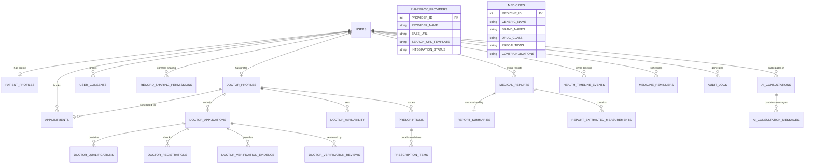

# AI Health Clinic — Database Entity-Relationship Diagram

```mermaid
erDiagram
    USERS ||--o| PATIENT_PROFILES : "has profile"
    USERS ||--o| DOCTOR_PROFILES : "has profile"
    USERS ||--o{ USER_CONSENTS : "grants"
    USERS ||--o{ RECORD_SHARING_PERMISSIONS : "controls sharing"
    USERS ||--o{ MEDICAL_REPORTS : "owns reports"
    USERS ||--o{ AI_CONSULTATIONS : "participates in"
    USERS ||--o{ APPOINTMENTS : "books"
    USERS ||--o{ HEALTH_TIMELINE_EVENTS : "owns timeline"
    USERS ||--o{ MEDICINE_REMINDERS : "schedules"
    USERS ||--o{ AUDIT_LOGS : "generates"

    DOCTOR_PROFILES ||--o{ DOCTOR_APPLICATIONS : "submits"
    DOCTOR_APPLICATIONS ||--o{ DOCTOR_QUALIFICATIONS : "contains"
    DOCTOR_APPLICATIONS ||--o{ DOCTOR_REGISTRATIONS : "checks"
    DOCTOR_APPLICATIONS ||--o{ DOCTOR_VERIFICATION_EVIDENCE : "provides"
    DOCTOR_APPLICATIONS ||--o{ DOCTOR_VERIFICATION_REVIEWS : "reviewed by"

    DOCTOR_PROFILES ||--o{ APPOINTMENTS : "scheduled for"
    DOCTOR_PROFILES ||--o{ DOCTOR_AVAILABILITY : "sets"
    DOCTOR_PROFILES ||--o{ PRESCRIPTIONS : "issues"

    MEDICAL_REPORTS ||--o| REPORT_SUMMARIES : "summarized by"
    MEDICAL_REPORTS ||--o{ REPORT_EXTRACTED_MEASUREMENTS : "contains"

    AI_CONSULTATIONS ||--o{ AI_CONSULTATION_MESSAGES : "contains messages"

    PRESCRIPTIONS ||--o{ PRESCRIPTION_ITEMS : "details medicines"

    PHARMACY_PROVIDERS {
        int PROVIDER_ID PK
        string PROVIDER_NAME
        string BASE_URL
        string SEARCH_URL_TEMPLATE
        string INTEGRATION_STATUS
    }

    MEDICINES {
        int MEDICINE_ID PK
        string GENERIC_NAME
        string BRAND_NAMES
        string DRUG_CLASS
        string PRECAUTIONS
        string CONTRAINDICATIONS
    }
```
